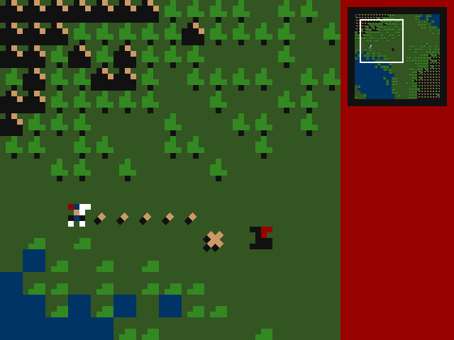

# HoMM 1K

_HoMM 1K_ is a homage to _Heroes of Might and Magic 3_ and a submission for
JS1K 2019. Play it online at https://piesku.com/homm1k.

## Motivation

The theme of this year's JS1K is _X_, to celebrate its tenth anniversary. The
theme made me think of the iconic _X_ which marks the destination of heroes'
movement in _HoMM_.

## Goal of the Game

The goal of the game is to capture the dragon roaming your realm. Your devout
knight is at your service, his armor shining bright in the sun, ready to do
your bidding. Plan their moves carefully and try to corner the dragon so that
it cannot flee this time.

## Features

The game is written in JavaScript using the Canvas 2D API. It runs in modern
Firefox and Chrome. The minified and compressed source code is under 1024
bytes.

The list of fetures includes:

  - 4 pixel x 4 pixel sprites using 7 colors and transparency.
  - The details of the terrain are generated randomly.
  - The map is larger than the viewport. Click the minimap to set the visible
    fragment.
  - Plan your knight's moves by clicking on the map once. The path-finding
      algorithm will trace the path to the destination. Click a second time to
      confirm the move.
  - The dragon responds to your moves and tries to run away from your knight.
  - Once you capture the dragon, the win screen appears and the game ends.
    Reload the page to play again.

## Running locally

Refer to `index.js` for the documented source code of the game. To play, open
`index.html` in the browser. Set the `DEBUG` global in `index.js` to `true` to
see details of the path-finding algorithm and the dragon's AI.

To build the optimized version of the source code, install the dependencies
with `npm install` and run `make`.
